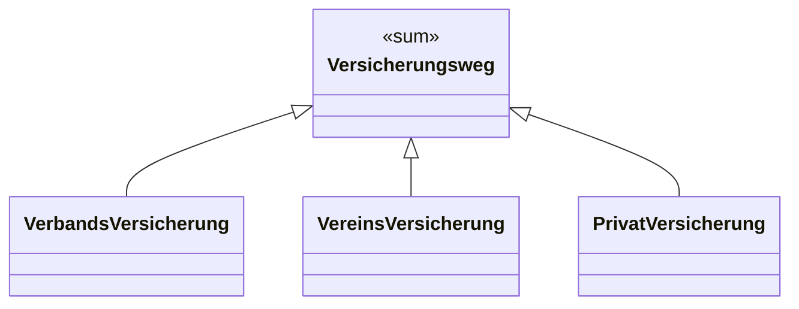

# 19. Data-Model stereotypes — product types and sum types

Date: 2026-05-28

## Status

Accepted

## Context

We are about to start modelling Aquarius entities in `wiki/data-models/`. Functional
programming gives us a clean type-theoretical dichotomy that traditional ER/UML
modelling handles asymmetrically:

- **Product type** (`A × B × C`) — a record with **all** of its fields present.
  Examples: a Kind has *vorname* AND *nachname* AND *geburtsdatum* AND … . The
  ER/UML world models this natively as an entity/class.
- **Sum type** (`A | B | C`) — a tagged union; a value is **exactly one** of
  several alternatives, each possibly carrying a different payload. ER/UML models
  this awkwardly via inheritance or via a discriminator column with a forest of
  nullable fields — both of which lose intent.

The current `_templates/data-model.md` is silent on this; it treats one file as
"an aggregate or entity cluster" with prose-style attribute and relationship lists.
That granularity is too coarse for a graph projection (analogous to the
context-diagram projection in ADR-0013) and offers no place for the sum-type
distinction.

A typical Aquarius example of a real sum type with payloads is the
[[CON-001-versicherungspflicht|Versicherungsweg]], which is exactly one of:

```
Versicherungsweg
  = VerbandsVersicherung { kaderId, verband }
  | VereinsVersicherung   { polizzenNr, versicherer, gültigBis }
  | PrivatVersicherung    { polizzenNr, versicherer, gültigBis }
```

The three variants share *no* common payload beyond the discriminator. Modelling
them as one entity with nullable fields would hide this.

## Decision

We introduce a **`stereotype:`** field on `data-model` with **three** values that
mirror the type-theoretical distinction:

| Stereotype | Meaning | Identity | Use for |
|---|---|---|---|
| `entity` | product type **with** identity | yes (key) | first-class business objects (Kind, Wettkampf, Anmeldung, Start) |
| `value-object` | product type **without** identity | no (equality by value) | data clusters that have no lifecycle of their own (Punktzahl, Adresse) |
| `sum-type` | tagged union | n/a | values that are exactly one of several heterogeneous variants (Versicherungsweg) |

### Two flavours of "sum type" — only one needs its own file

1. **Enum-style (no payload).** A finite set of named tags with **no associated
   data**. Examples: `Start.status ∈ {geplant, läuft, bewertet, annulliert}`,
   `Anmeldung.status ∈ {angemeldet, bestätigt, abgesagt, erschienen, nicht_erschienen}`.

   → Modelled **inline as an attribute type**, e.g.
   `type: "enum(geplant, läuft, bewertet, annulliert)"`. **No own file.** Don't
   create stand-alone DM files just for the type-theoretical purity — that
   inflates the model.

2. **Tagged-union with payloads.** Variants carry **different** fields. Each
   variant *does* deserve its own file.

   → Modelled as a `sum-type` DM file (the abstract container) **plus one DM
   file per variant** (each typically a `value-object`). The variants link to
   the sum-type via a `parent:` wikilink — analogous to the Epic→Feature→Story
   hierarchy on functional-requirements (ADR-0012). This requires adding
   `parent:` to the data-model template.

### Granularity shift

This decision implies a **one-entity-per-file** granularity (not
one-aggregate-per-file as the legacy template wording suggested). An aggregate
becomes a *grouping* over multiple DM files, expressed through a separate field
(e.g. `aggregate:` pointing to the aggregate-root entity) — to be operationalised
in a follow-up ADR.

### Projection

In a future Mermaid `classDiagram` projection (analogous to the context-diagram
projection in ADR-0013), a sum-type renders as an abstract class annotated
`<<sum>>`, with inheritance arrows to its variants:



The arrow shape (`<|--`) is the standard generalisation arrow; the `<<sum>>`
stereotype carries the intent that this is a *closed* set of variants (in
contrast to OOP inheritance, which is typically *open*).

## Consequences

- `_templates/data-model.md` gets a `stereotype:` field with the three enum
  values and a one-line hint pointing here.
- `_templates/data-model.md` gets a `parent:` field (used by sum-type variants
  to point at their sum-type; empty for top-level entities).
- The legacy "aggregate/entity cluster" wording in the template is updated to
  "one entity / value-object / sum-type per file".
- Aggregate-root marker, the structured `attributes:` / `relationships:` syntax,
  and the projection code are **out of scope here** — they belong to a follow-up
  schema ADR ("data-model operational schema") to be written when we ingest the
  first concrete entities.
- No content type added or removed; we stay at 12 types (ADR-0012, ADR-0016 with
  Goals adds the 13th… check current count when filing the next schema ADR).

## Alternatives considered

1. **Keep aggregate-per-file, inline everything in prose.** Rejected — bad for
   graph projection, hard to query, no place for the sum-type distinction.
2. **Model sum types as OOP inheritance only (no separate stereotype).**
   Rejected — conflates *is-a* (open extension) with *variants-of* (closed
   tagging). `Kampfrichter is-a Offizieller` is genuine inheritance;
   `Versicherungsweg = A | B | C` is a closed sum. Same diagram shape, different
   intent; the stereotype preserves the intent.
3. **Generics / parametrised types** (e.g. `Result<T>`, `Option<T>`). Deferred
   ("erstmal genügt das so") — most domain models don't need them, and our
   pragmatic enum + sum-type cover the Aquarius cases we know.
4. **Multiple discriminator dimensions on a single entity** (e.g. status × kind
   × source as three orthogonal enums on one record). Not addressed here; if it
   comes up, model each dimension as a separate inline enum attribute. A
   "matrix" sum-type isn't needed.

## Related

- ADR-0002 — Content-type taxonomy (data-model has been one of the types since
  the start; this ADR sharpens what *goes into* it).
- ADR-0012 — Functional-requirement stereotypes (`epic | feature | story`); same
  pattern (one type, multiple stereotypes) is now applied to data-model.
- ADR-0013 — Data flows as edges; context diagram as projection. Same projection
  pattern will apply to the data-model class diagram (Mermaid `classDiagram`
  from structured fields).
- [[GLO-…]] glossary — every entity DM file should link its glossary anchor in
  `related:` when one exists; the glossary is the ubiquitous-language reference.
